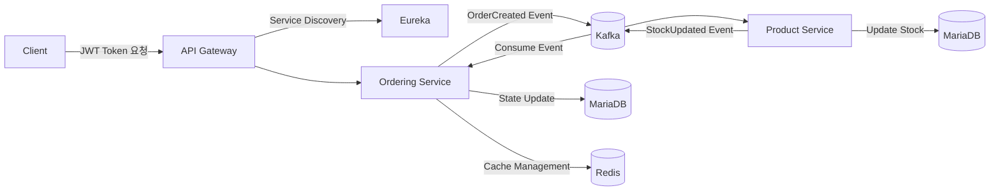

# Order System MSA – Saga 기반 보상 트랜잭션 설계

## 프로젝트 개요
이 프로젝트는 <b>모놀리식 주문 시스템을 MSA(Microservice Architecture)</b>로 리팩토링하고,  
서비스 간 데이터 정합성을 보장하기 위해 <b>Kafka 기반 Saga 패턴(보상 트랜잭션)</b>을 적용한 주문 처리 시스템입니다.

최종 목표는 서비스 간 강결합 없이, 장애 상황에서도 데이터 일관성을 유지하며  
확장성과 복원력을 갖춘 분산 아키텍처를 설계하는 것입니다.

### 주요 목표
- 서비스 간 <b>강결합 제거</b>
- <b>동기 트랜잭션 한계</b>(지연, 실패 전파) 해결
- <b>장애 상황</b>에서도 데이터 정합성 보장
- <b>이벤트 중심 아키텍처(Event-Driven)</b> 기반의 확장성 확보

***

## 아키텍처 구성

### 마이크로서비스
| 서비스 명 | 주요 역할 |
|------------|------------|
| <b>api-gateway</b> | 외부 요청 라우팅, JWT 인증 수행 |
| <b>eureka</b> | 서비스 디스커버리 및 로드밸런싱 관리 |
| <b>member-service</b> | 회원 정보 및 인증 관리 |
| <b>product-service</b> | 상품 정보 및 재고 관리 |
| <b>ordering-service</b> | 주문 생성, 상태 변경, 보상 트랜잭션 수행 |

### 인프라 구성
| 구성 요소 | 역할 |
|------------|------|
| <b>Kafka (KRaft)</b> | 이벤트 브로커, 서비스 간 비동기 통신 |
| <b>MariaDB</b> | 서비스별 데이터 저장소 |
| <b>Redis</b> | 세션 캐시 및 임시 데이터 저장 |
| <b>Docker Compose</b> | 로컬 개발 환경 컨테이너 오케스트레이션 |

***

## 시스템 아키텍처 다이어그램



***

## 주문 처리 플로우

### 성공 시 플로우
1. `ordering-service`에서 주문 생성 (`status = PENDING`)  
2. 재고 차감 이벤트(`ORDER_CREATED`)를 Kafka로 발행  
3. `product-service`가 이벤트 수신 후 재고를 차감  
4. 재고 차감 성공 시 `ORDER_SUCCESS` 이벤트 발행  
5. `ordering-service`가 성공 이벤트를 수신 후 상태를 `COMPLETE`로 변경  

### 재고 부족 시 플로우
1. 주문 생성 (`status = PENDING`)  
2. 재고 차감 이벤트(`ORDER_CREATED`) 발행  
3. `product-service`에서 재고 부족으로 실패 처리  
4. `ORDER_FAIL` 이벤트 발행  
5. `ordering-service`가 이벤트 수신 후 주문 상태를 `CANCEL`로 변경 (보상 트랜잭션 수행)  

### 주문 상태 전이
```
CREATE → PENDING → COMPLETE
            ↘ CANCEL
```

***

## Saga 패턴 적용 이유
MSA 환경에서는 하나의 트랜잭션으로 여러 서비스의 작업을 묶기 어려우며,  
2PC(2-Phase Commit) 방식은 성능 저하와 복잡도를 초래합니다.  
따라서 <b>이벤트 기반 보상 트랜잭션(Saga Pattern)</b>을 통해 다음을 달성했습니다.

- 서비스별 독립성 확보  
- 장애 시 롤백 대신 <b>보상 트랜잭션(Compensation Transaction)</b> 수행  
- <b>최종 일관성(Eventual Consistency)</b> 기반 데이터 정합성 유지  

***

## 서비스별 역할

### ordering-service
- 주문 생성 및 Kafka 이벤트 발행 (`ORDER_CREATED`)  
- `ORDER_SUCCESS`, `ORDER_FAIL` 이벤트 수신  
- 주문 상태 변경 (`COMPLETE`, `CANCEL`)  
- 보상 트랜잭션 수행 (주문 취소 시 상태 롤백 처리)  

### product-service
- Kafka 이벤트 수신 후 재고 차감 수행  
- 재고 부족 시 `ORDER_FAIL`, 성공 시 `ORDER_SUCCESS` 이벤트 발행  
- `orderId + productId` 기준으로 멱등성(Idempotency) 처리  
- 처리 결과 로그 기록 및 모니터링  

***

## 인증 처리 전략
- <b>Gateway (Spring Cloud Gateway)</b>에서만 JWT 검증 수행  
- 검증 완료된 사용자 정보를 <b>Header</b>에 포함해 내부 서비스로 전달  
- 내부 서비스는 <b>Private Network</b> 내부에서만 접근 가능  
- 외부 요청은 반드시 Gateway를 통해야 하며, 직접 호출 차단  

***

## 트러블슈팅 및 해결 과정

### 1. 동기 호출로 인한 서비스 강결합
<b>문제:</b> 주문 생성 시 `product-service`를 동기 호출 → 장애 전파  
<b>해결:</b> Kafka 기반 비동기 이벤트 전송 구조로 전환 및 Saga 도입  
<b>효과:</b> 장애 격리, 처리 지연 감소, 서비스 확장 용이  

### 2. 재고 차감 실패 시 데이터 정합성 문제
<b>문제:</b> 주문 생성 성공 후 재고 차감 실패 시 상태 불일치  
<b>해결:</b> 실패 이벤트 수신 시 주문 상태를 `CANCEL` 처리  
<b>효과:</b> 분산 환경에서도 데이터 정합성 유지  

### 3. Kafka 중복 메시지 소비로 인한 재고 중복 차감
<b>문제:</b> Kafka는 `at-least-once` 방식으로 동작하여 중복 이벤트 발생 가능  
<b>해결:</b> `orderId + productId` 기반 멱등성 로직 적용  
<b>효과:</b> 중복 처리 방지, 재고 정합성 유지  

### 4. Gateway를 우회한 직접 접근
<b>문제:</b> 외부에서 내부 API 직접 접근 가능  
<b>해결:</b> 내부 서비스는 Private Subnet에서만 접근 허용, Gateway만 Public으로 노출  
<b>효과:</b> 인증 우회 차단, 네트워크 레벨 보안 강화  

### 5. 서비스 확장 시 포트 충돌
<b>문제:</b> 서비스 인스턴스 확장 시 포트 충돌 발생  
<b>해결:</b> `server.port=0` 설정 → 동적 포트 할당, Eureka 기반 로드밸런싱 적용  
<b>효과:</b> 인스턴스 단위 확장성 확보  

***

## 이벤트 메시지 예시

### 주문 생성 이벤트 (`ORDER_CREATED`)
```json
{
  "eventType": "ORDER_CREATED",
  "orderId": 1023,
  "memberId": 7,
  "productId": 31,
  "quantity": 2,
  "timestamp": "2026-03-05T15:20:00Z"
}
```

### 재고 차감 성공 이벤트 (`ORDER_SUCCESS`)
```json
{
  "eventType": "ORDER_SUCCESS",
  "orderId": 1023,
  "productId": 31,
  "remainingStock": 98,
  "timestamp": "2026-03-05T15:20:03Z"
}
```

### 재고 차감 실패 이벤트 (`ORDER_FAIL`)
```json
{
  "eventType": "ORDER_FAIL",
  "orderId": 1023,
  "productId": 31,
  "reason": "재고 부족",
  "timestamp": "2026-03-05T15:20:02Z"
}
```

***

## API 사용 예시

### 주문 생성 요청
<b>POST /api/orders</b>

#### Request
```json
{
  "memberId": 7,
  "productId": 31,
  "quantity": 2
}
```

#### Response
```json
{
  "orderId": 1023,
  "status": "PENDING",
  "message": "Order successfully created. Awaiting stock confirmation."
}
```

### 주문 상태 조회
<b>GET /api/orders/{orderId}</b>

#### Response
```json
{
  "orderId": 1023,
  "memberId": 7,
  "productId": 31,
  "status": "COMPLETE"
}
```

***

## 기술 스택
- <b>Backend Framework:</b> Spring Boot  
- <b>API Gateway:</b> Spring Cloud Gateway  
- <b>Service Discovery:</b> Eureka  
- <b>Message Broker:</b> Kafka (KRaft)  
- <b>Database:</b> MariaDB  
- <b>Cache:</b> Redis  
- <b>Communication:</b> OpenFeign  
- <b>Persistence:</b> Spring Data JPA  
- <b>Container:</b> Docker Compose  

***

## 실행 방법

```bash
# 1. 인프라 실행
docker-compose up -d

# 2. Spring Boot 애플리케이션 실행 순서
# 반드시 Eureka → Gateway → Member → Product → Ordering 순으로 실행
1. eureka
2. api-gateway
3. member-service
4. product-service
5. ordering-service
```

***

## 프로젝트 회고
- <b>동기식 구조 → 이벤트 기반 구조 전환</b>을 통해 MSA의 장단점을 체감  
- <b>Saga 패턴</b>을 직접 설계하며 “보상 트랜잭션”의 개념을 명확히 이해  
- 장애 상황 및 메시지 중복 등 현실적인 문제를 경험하고 해결  
- <b>즉각적 일관성보다 최종 일관성(Eventual Consistency)</b>이 요구되는 MSA 철학 확립  
- 결과적으로 서비스 간 결합도를 낮춘, 복원력 있는 주문 처리 구조 완성  
